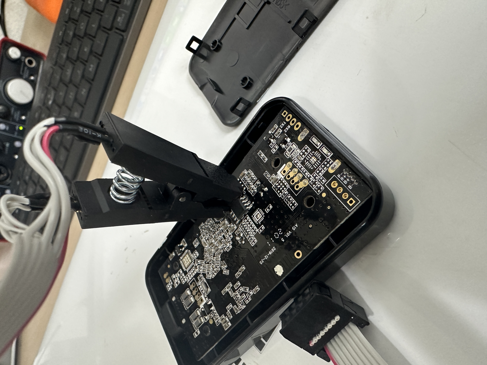
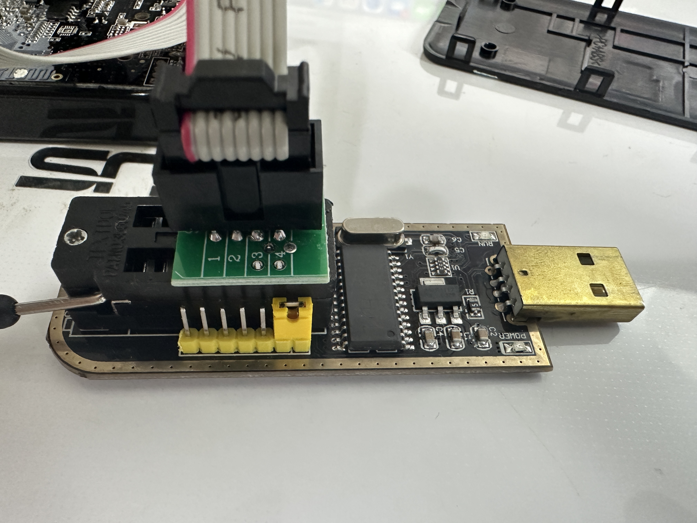
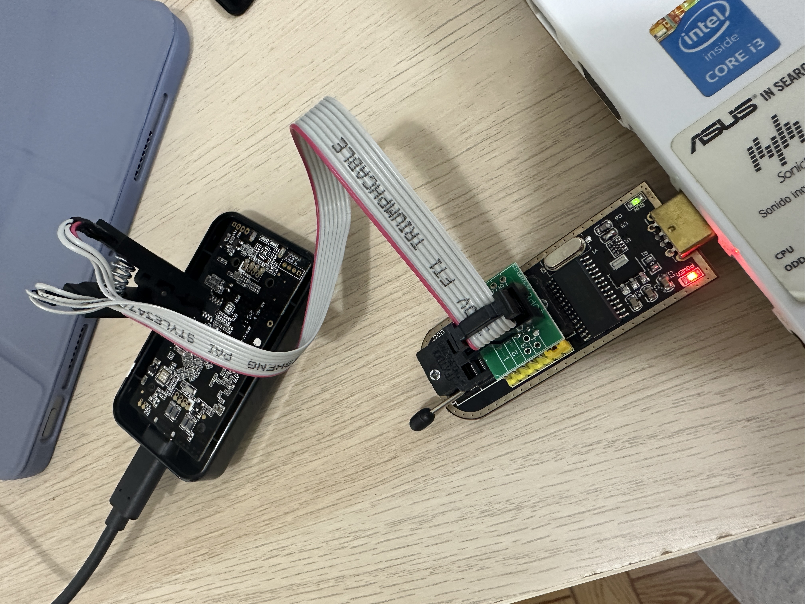

# Unbrick o revivir el dispositivo Carlinkit V3 tras actualización OTA fallida

El objetivo de este tutorial es ayudar al usuario a recuperar su dispositivo Carlinkit V3 brikeado.

## Herramientas necesarias:

- Dispositivo Carlinkit V3 (CPC200-U2W Plus) Brikeado
- Dispositivo SOIC8 para flashear la EEPROM con una nueva BIOS [Amazon](https://www.amazon.es/dp/B08HQB1VL8?psc=1&ref=ppx_yo2ov_dt_b_product_details)
- Ordenador con Windows
- Software y drivers (Incluidos en el repositorio) [Aquí](Software/)
- Nueva imagen de la BIOS y nuevo Firmware para el Carlinkit (Incluidos en el repositorio) [Firmware aquí](Firmware/) [BIOS aquí](BIOS/)

## Proceso para revivir tu Carlinkit:

1. Instalar los drivers y el software.

2. Quitar la tapa inferior del Carlinkit (Sale sin problemas si haces palanca con cuidado con un destornillador plano, por uno de los laterales)
   

3. Conectar el adaptador SOIC8 al chip de 8 pines EEPROM tal y como figura en la imagen. El cable rojo del adaptador debe coincidir con el punto del chip de 8 pines EEPROM
      

4. Conectar el adaptador SOIC8 al USB del ordenador.
   

5. Abrir el programa que instalaste previamente "AsProgrammer"

6. Pulsar en la esquina superior izquierda de AsProgrammer, la opción del menú "IC" y posteriormente pulsar sobre "Search" en el submenú.
   

7. Escribir "MX25L12835F" para cargar tu modelo.
   

8. Abrir el Firmware de la BIOS (Tiene extensión .BIN) desde la opción "Open file" Prueba con cualquiera de las 2 opciones que tienes en la carpeta BIOS del repositorio [BIOS](BIOS/)
    

9. Le daremos a la flecha que hay en el botón del programa para programar IC (El cuarto botón de la barra de herramientas superior, empezando por la izquierda) Y haremos click sobre la opción que nos sale "Unprotect -> erase -> programm -> verify"
    

10. Esperamos hasta que la consola nos muestre que se ha finalizado el proceso.

11. Desconectamos el adaptador SOIC8 y conectamos el Carlinkit a una fuente de alimentación (No nos sirven los puertos USB del ordenador ni del coche)

12. Ahora debería mostrar la luz roja y verde cada vez más rápido hasta que se apague. Esperar algo menos de un minuto para que muestre una luz roja fija.
    

13. Probar a conectarlo en tu coche para ver si ya funciona. Si no funciona, pasar al siguiente paso.

14. Si con el paso anterior, tienes algún error de funcionamiento, tendremos que probar a actualizar la versión de software del Carlinkit vía USB.
    Para ello necesitas un pendrive de menos de 32 GB formateado en FAT32.
    Introduce el archivo de la carpeta [Firmware](Firmware) en la raíz del pendrive y conéctalo al USB del Carlinkit después de haberlo conectado a una fuente de alimentación y tenga la luz led en rojo de manera fija.

15. Deberías ver cómo la luz empieza a parpadear en rojo y verde durante algún tiempo, para posteriormente apagarse y volver a ponerse en rojo fijo. En este momento debes volver a probarlo en el coche.
