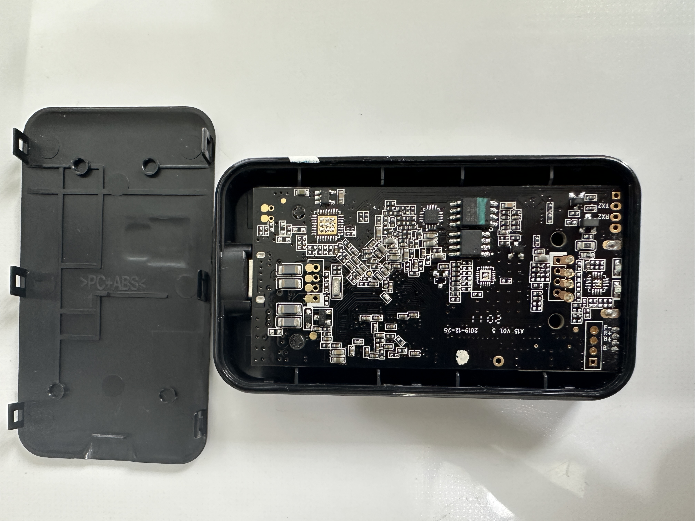
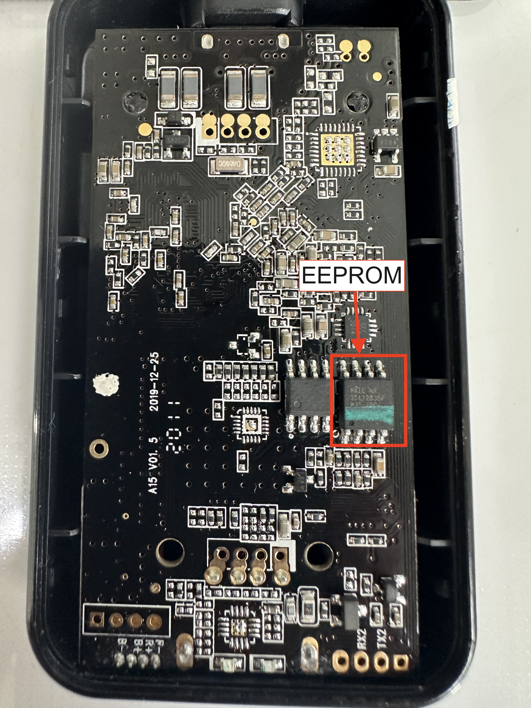
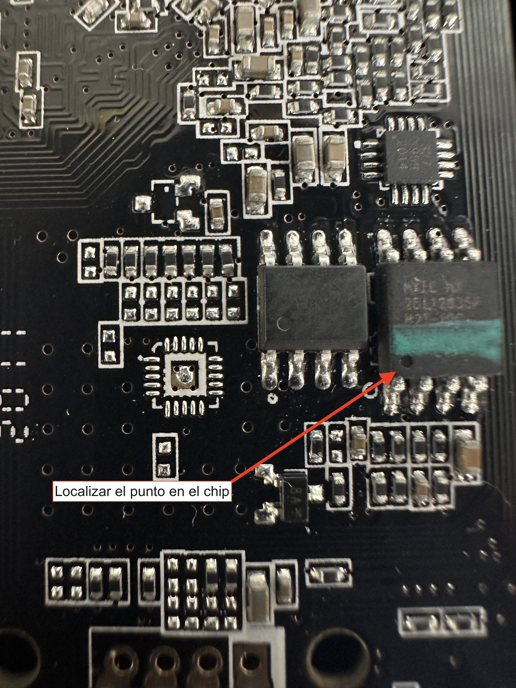
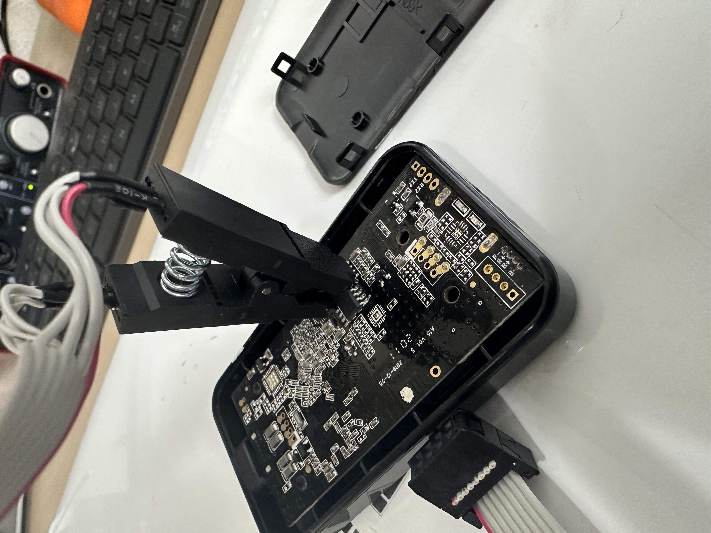
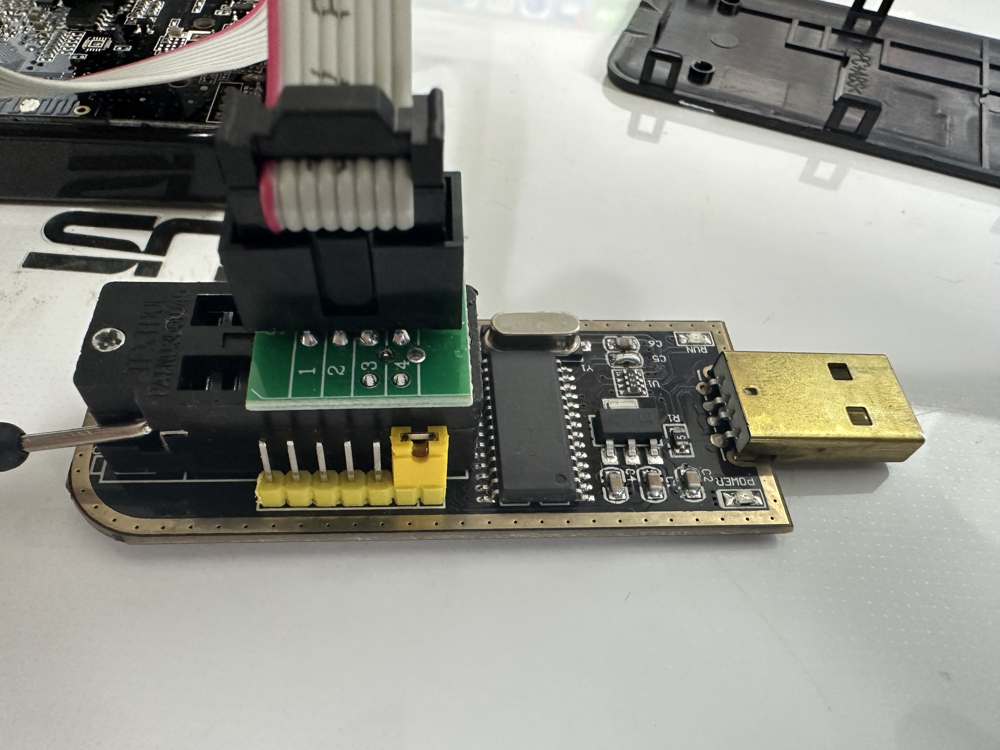
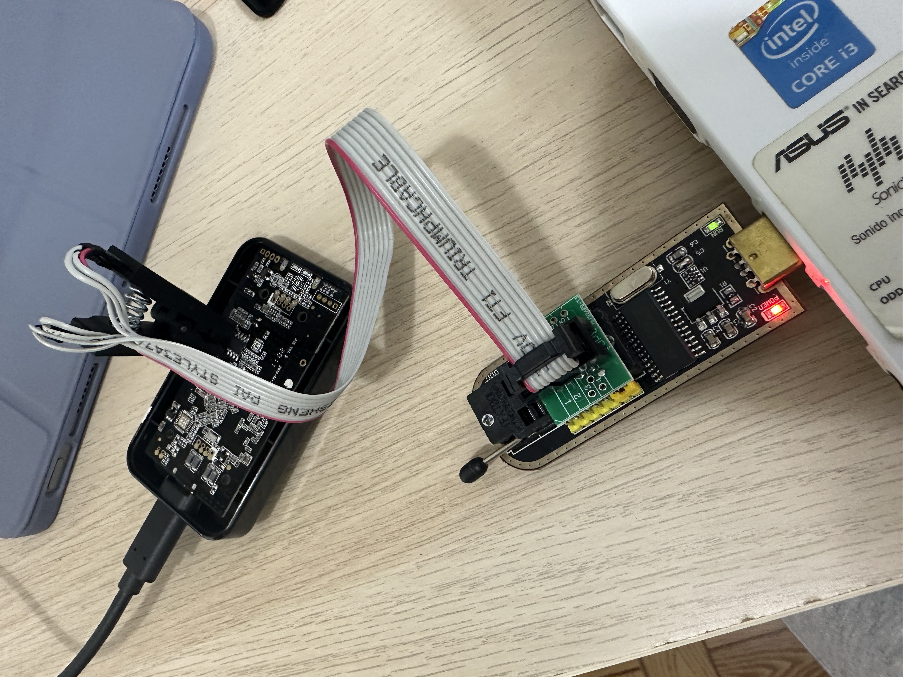
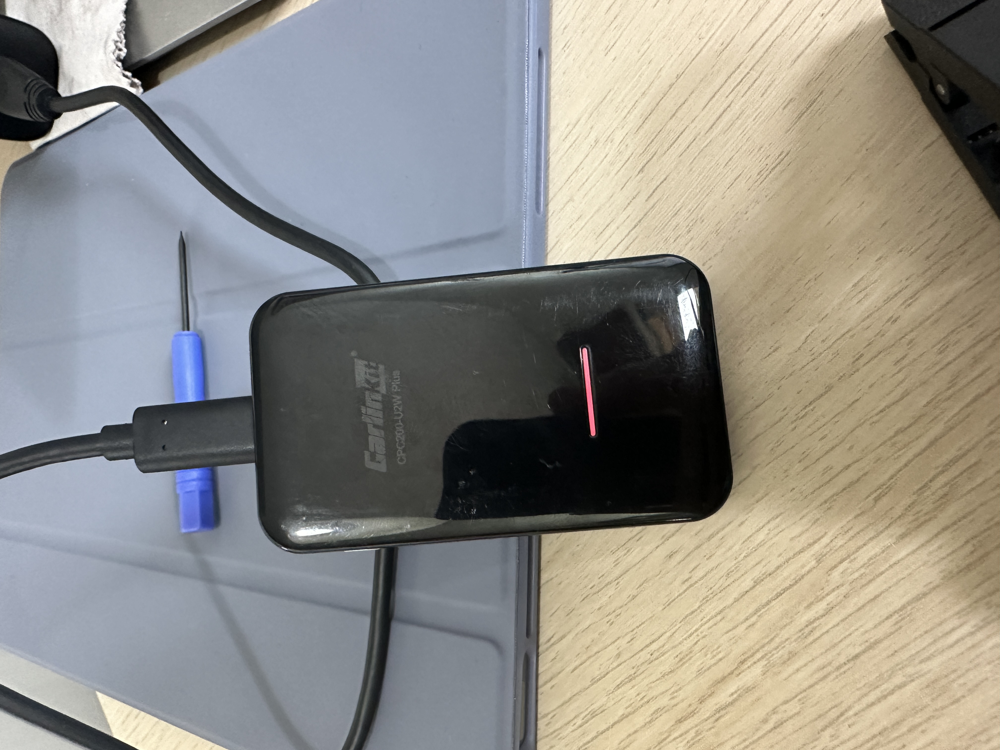

# Unbrick or revive Carlinkit V3 device after failed OTA update

The aim of this tutorial is to assist the user in recovering their bricked Carlinkit V3 device. I have obtained information, updates and images to flash from [Ludwig-v](https://github.com/ludwig-v/wireless-carplay-dongle-reverse-engineering) and [this  Website](https://placaschinas.com/como/asprogrammer-flashear-bios-con-programador/)

Disclaimer:

The content of this tutorial is provided for informational purposes only. The use of this guide and the application of its instructions to unbrick or revive the Carlinkit V3 device is done at the user's own risk. The author is not liable for any damage or loss that may result from following this tutorial. It is strongly recommended to follow the instructions with caution, and if you are unsure about any step, seek additional advice from a subject matter expert.

## Necessary Tools:

- Bricked Carlinkit V3 Device (CPC200-U2W Plus)
- SOIC8 device for flashing the EEPROM with a new BIOS [Amazon](https://www.amazon.es/dp/B08HQB1VL8?psc=1&ref=ppx_yo2ov_dt_b_product_details)
- Computer with Windows
- Software and drivers (Included in the repository) [Here](Software/)
- New BIOS image and new Firmware for the Carlinkit (Included in the repository) [Firmware here](Firmware/) [BIOS here](BIOS/)

## Process to revive your Carlinkit:

1. Install the drivers and software.

2. Remove the bottom cover of the Carlinkit (Comes off easily if you carefully pry it with a flathead screwdriver from one of the sides)
   

3. Connect the SOIC8 adapter to the 8-pin EEPROM chip as shown in the image. The red cable of the adapter should align with the point on the 8-pin EEPROM chip.
      

4. Connect the SOIC8 adapter to the computer's USB port.
   

5. Open the program you installed previously, "AsProgrammer."

6. Click on the top-left corner of AsProgrammer, the "IC" option, and then click on "Search" in the submenu.
   

7. Type "MX25L12835F" to load your model.
   

8. Open the BIOS Firmware (It has a .BIN extension) from the "Open file" option. Try either of the 2 options you have in the BIOS folder of the repository [BIOS](BIOS/)
    

9. Click the arrow on the "Program IC" button (the fourth button from the left on the top toolbar) and click on the option that appears, "Unprotect -> erase -> programm -> verify."
    

10. Wait until the console shows that the process has finished.

11. Disconnect the SOIC8 adapter and connect the Carlinkit to a power source (USB ports from the computer or the car won't work).

12. Now, it should display the red and green lights getting faster until they turn off. Wait for just under a minute for it to show a steady red light.
    

13. Try connecting it in your car to see if it works now. If it doesn't, proceed to the next step.

14. If you encounter any malfunction with the previous step, you'll need to try updating the Carlinkit's software version via USB.
    For this, you need a pendrive of less than 32 GB formatted in FAT32.
    Place the file from the [Firmware](Firmware) folder at the root of the pendrive and connect it to the Carlinkit's USB port after connecting it to a power source and having the LED light steady red.

15. You should see the light start blinking in red and green for some time, then turn off and turn on steady red again. At this point, you should try it in the car again.
